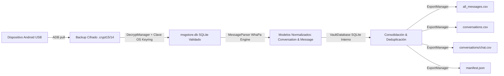

# Arquitectura del Sistema — WhatsApp Backup to CSV

## 1. Flujo de Datos

---

## 2. Componentes y Responsabilidades

| Componente | Módulo | Responsabilidad |
|---|---|---|
| **DeviceManager** | `src/device_manager.py` | Descubrimiento de dispositivos USB, comprobación de autorización ADB, detección de paquetes WhatsApp, escaneo de rutas de bases de datos remotas y transferencia segura por bloques. |
| **SecretManager** | `src/secret_manager.py` | Validación estricta de claves hexadecimales de 64 dígitos, persistencia segura en el gestor de credenciales del sistema operativo (`keyring`) y sanitización de salida para logs/UI. |
| **DecryptManager** | `src/decrypt_manager.py` | Detección de formatos (`crypt15`, `crypt14`, `crypt12`), descifrado criptográfico mediante AES-GCM / HMAC y validación estricta de cabecera SQLite y `PRAGMA integrity_check`. |
| **MessageParser** | `src/message_parser.py` | Integración del motor de extracción WhaPa y parser directo de respaldo. Mapeo a modelos canónicos de mensaje preservando Unicode, chats grupales, remitentes y referencias multimedia. |
| **VaultDatabase** | `src/database.py` | Base de datos SQLite local de consolidación incremental. Deduplica mensajes mediante `message_uid` y conserva el historial completo de ejecuciones y backups. |
| **ExportManager** | `src/export_manager.py` | Generación de archivos CSV con codificación `UTF-8 con BOM (utf-8-sig)`, escape contra inyecciones de fórmulas y reemplazo atómico de archivos. |
| **ExportPipeline** | `src/pipeline.py` | Orquestador desacoplado con notificaciones de progreso por etapas, apto para ejecución desatendida, CLI e interfaz gráfica. |
| **AppUI & CLI** | `src/app.py`, `src/cli.py` | Interfaces de usuario de escritorio (Tkinter) y línea de comandos (Argparse). |
